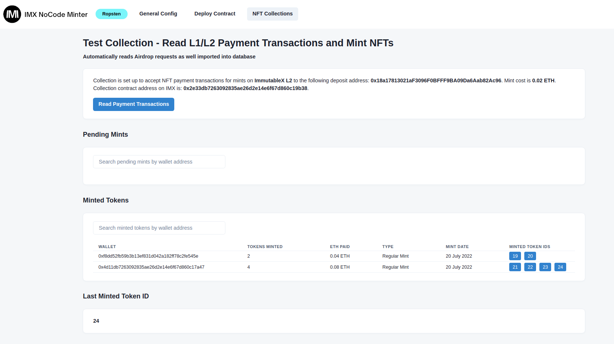

## IMX No-code Minting Tool 

&nbsp;



&nbsp;

This is a no-code minting backend for ImmutableX, which lets you create collections and mint NFTs without needing to have any coding knowledge. All you need to do is follow the steps below:


1\. Install Node.js and MySQL database on your computer or server.

2\. Clone this project from the repository and install its dependencies:

```bash
npm install
```

3\. Copy **config.example.js** to **config.js**

4\. Build the project and follow the wizard:

```bash
npm run dev
```
5\. Create your collections either on Testnet or Mainnet and mint NFTs. Thanks to gas free minting and trading on ImmutableX Layer 2 scaling solution with the security of Ethereum!

#

*If you need any custom development or consultancy for your project you can contact me at **iliyan#1066** on Discord.* 

